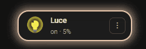
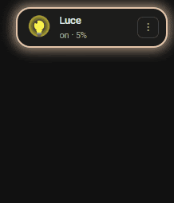
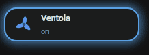
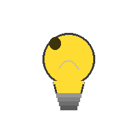
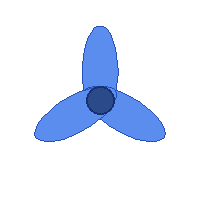
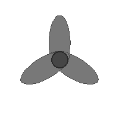
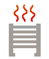

# 🌟 Animation Card

[](https://github.com/hacs/integration)
[](https://github.com/themask1987/animation-card/releases)
[](LICENSE)

Una card Lovelace per Home Assistant con **icone animate**, **glow configurabile**, **azioni avanzate** e un editor visivo completo. Progettata per essere compatta, bella e altamente personalizzabile.

---

## ✨ Preview

| Luce accesa | Luce (variante 2) | Ventola |
|:-----------:|:-----------------:|:-------:|
|  |  |  |

---

## 📦 Installazione

### Via HACS (consigliato)

1. Apri HACS → **Frontend**
2. Clicca il menu ⋮ in alto a destra → **Custom repositories**
3. Aggiungi `https://github.com/themask1987/animation-card` come tipo **Lovelace**
4. Cerca **Animation Card** e installa
5. Ricarica la pagina (hard reload: `Ctrl+Shift+R`)

### Manuale

1. Scarica `animation-card.js` dalla [pagina releases](https://github.com/themask1987/animation-card/releases)
2. Copialo in `config/www/` (o in `hacsfiles/animation-card/`)
3. In Lovelace → **Gestisci risorse** → aggiungi `/local/animation-card.js` come **JavaScript module**
4. Ricarica la pagina

---

## 🚀 Configurazione rapida

```yaml
type: custom:animation-card
entity: light.isola
```

Questo è sufficiente per avere una card funzionante con le impostazioni di default. Tutto il resto è configurabile dall'editor visivo.

---

## 🎛️ Editor visivo

L'editor è organizzato in **sezioni collassabili**. Apri solo quella che ti serve.

| Sezione | Contenuto |
|---------|-----------|
| 📦 **Entità & Icone** | Selezione entità con ricerca, icona ON e icona OFF |
| 🏷️ **Nome & Sottotesto** | Visibilità nome, dimensioni testo, campi sottotesto |
| 📐 **Layout** | Modalità riga/tile, allineamento, altezza, visibilità condizionale |
| ✨ **Glow** | Colore, intensità, velocità animazione per stato ON e OFF |
| ⚡ **Azioni** | Click, doppio click, long press con azione dedicata |
| ⋮ **Shortcut dropdown** | Menu rapido con fino a 4 azioni personalizzate |

---

## 🖼️ Modalità layout

### Riga (default)
Icona a sinistra, nome e sottotesto a destra. Compatta, ideale per liste di dispositivi.

```yaml
layout_mode: row
card_height: 56   # px, range 44-120
text_align: left  # left | center
```

### Tile
Icona a piena card, nome e sottotesto sovrapposti in basso con gradiente. Ideale per griglie.

```yaml
layout_mode: tile
card_height: 100
```

---

## ✨ Glow

Il glow è un'animazione pulsante che cambia colore e intensità. Configurabile separatamente per stato ON e OFF.

### Modalità colore

| Modalità | Descrizione |
|----------|-------------|
| `preset` | Palette di colori predefiniti (giallo caldo, arancione, blu, verde, rosso, viola) |
| `entity` | Segue il colore RGB reale dell'entità `light.*`. Fallback rosso per entità senza colore (es. switch) |
| `custom` | Color wheel: scegli qualsiasi colore con il selettore nativo del browser |

```yaml
glow_on_active: true
glow_on_color_mode: entity      # preset | entity | custom
glow_on_color: "255,200,60"     # usato se mode = preset
glow_on_color_hex: "#ffc83c"    # usato se mode = custom
glow_on_intensity: 1            # 0.3 - 2.0
glow_off_active: false
glow_off_color_mode: preset
glow_off_color: "100,180,255"
glow_off_intensity: 0.5
glow_speed: 2                   # secondi per ciclo (0.5 - 5)
```

---

## 🏷️ Nome e sottotesto

### Campi sottotesto disponibili

I campi attivi vengono concatenati con `·` e mostrati sotto il nome.

| Campo | Descrizione | Dominio |
|-------|-------------|---------|
| `state` | Stato dell'entità (on/off/…) | tutti |
| `last_changed` | Ultima modifica (es. "5 min fa") | tutti |
| `brightness` | Luminosità in % (0% se spenta) | `light` |
| `temperature` | Temperatura | `climate`, `sensor` |
| `humidity` | Umidità | `sensor`, `climate` |
| `friendly_name` | Nome descrittivo da HA | tutti |
| `custom_attr` | Qualsiasi attributo (inserisci il nome) | tutti |
| `static_text` | Testo fisso personalizzato | tutti |

> I campi non applicabili al dominio dell'entità vengono nascosti automaticamente nell'editor.

```yaml
show_name: true
name: "Isola cucina"          # opzionale, default = friendly_name
name_font_size: 14            # px, range 10-22
state_font_size: 12           # px, range 9-18
subtext_fields:
  - state
  - brightness
  - last_changed
subtext_custom_attr: current_power   # se custom_attr è attivo
subtext_static_text: "Cucina"        # se static_text è attivo
```

---

## ⚡ Azioni

Tre trigger indipendenti, ognuno con il proprio tipo di azione.

| Trigger | Chiave config | Default |
|---------|--------------|---------|
| Click singolo | `tap_action` | `toggle` |
| Doppio click | `double_tap_action` | `more-info` |
| Long press (500ms) | `hold_action` | `none` |

### Tipi di azione

**Toggle**
```yaml
tap_action: toggle
```

**More info**
```yaml
double_tap_action: more-info
```

**Naviga**
```yaml
hold_action: navigate
hold_navigate_path: /lovelace/cucina
```

**Chiama servizio**
```yaml
tap_action: call-service
tap_service_preset: light.turn_on       # o "custom" per inserimento libero
tap_service_custom: light.set_color_temp  # se preset = custom
tap_service_data: '{"brightness": 200, "color_temp": 370}'
```

---

## ⋮ Shortcut dropdown

Il tasto `⋮` appare sul lato destro della card solo quando sono configurati degli shortcut. Tap apre un menu verticale, tap fuori lo chiude.

Massimo **4 shortcut**, ognuno con:
- **Label** personalizzata
- **Azione**: Toggle, More info, Naviga, Chiama servizio
- **Colore icona**: blu, verde, ambra, rosso, viola

```yaml
shortcuts:
  - label: "Luminosità 50%"
    action: call-service
    service_preset: light.turn_on
    service_data: '{"brightness": 127}'
    color: blue
  - label: "Massima"
    action: call-service
    service_preset: light.turn_on
    service_data: '{"brightness": 255}'
    color: amber
  - label: "Vai a Cucina"
    action: navigate
    navigate_path: /lovelace/cucina
    color: green
  - label: "Spegni tutto"
    action: call-service
    service_preset: homeassistant.turn_off
    color: red
```

---

## 📐 Visibilità condizionale

Nascondi la card automaticamente in base allo stato di un'altra entità.

```yaml
visibility_entity: input_boolean.modalita_notte
visibility_state: "off"   # la card è visibile solo quando questa entità è "off"
```

---

## 🖼️ Icone

Le icone sono file `.gif` (animate) o `.png` statici posizionati in `/hacsfiles/animation-card/icons/`.

### Icone incluse

| ID | Preview | Tipo | Stato |
|----|---------|------|-------|
| `bulb_glow_esplosivo` |  | GIF animata | ON |
| `bulb_pulse_warm` |  | GIF animata | ON |
| `bulb_off` |  | PNG statico | OFF |
| `fan_on` |  | GIF animata | ON |
| `fan_off` |  | PNG statico | OFF |
| `scaldasalviette_on` |  | GIF animata | ON |
| `scaldasalviette_off` |  | PNG statico | OFF |

### Icona custom

```yaml
icon_on_id: custom
icon_on_path: /local/mia_icona_on.gif
icon_off_id: custom
icon_off_path: /local/mia_icona_off.png
```

---

## 📋 Configurazione completa di esempio

```yaml
type: custom:animation-card
entity: light.isola

# Icone
icon_on_id: bulb_glow_esplosivo
icon_off_id: bulb_off

# Nome e testo
show_name: true
name: "Isola"
name_font_size: 14
state_font_size: 12
subtext_fields:
  - state
  - brightness
  - last_changed

# Layout
layout_mode: row
card_height: 56
text_align: left

# Glow ON
glow_on_active: true
glow_on_color_mode: entity
glow_on_intensity: 1
glow_speed: 2

# Glow OFF
glow_off_active: false
glow_off_color_mode: preset
glow_off_color: "100,180,255"
glow_off_intensity: 0.5

# Azioni
tap_action: toggle
double_tap_action: more-info
hold_action: navigate
hold_navigate_path: /lovelace/cucina

# Shortcut
shortcuts:
  - label: "50%"
    action: call-service
    service_preset: light.turn_on
    service_data: '{"brightness": 127}'
    color: blue
  - label: "Max"
    action: call-service
    service_preset: light.turn_on
    service_data: '{"brightness": 255}'
    color: amber

# Visibilità condizionale
visibility_entity: input_boolean.modalita_ospiti
visibility_state: "on"
```

---

## 🔧 Aggiungere icone custom al bundle

Per aggiungere un'icona al registro interno (disponibile nel dropdown editor), modifica l'array `ICONS` in cima a `animation-card.js`:

```js
const ICONS = [
  // icone esistenti...
  { id: "mia_icona_on", label: "La mia icona", file: "mia_icona_on.gif" },
];
```

Poi copia il file nella cartella `icons/` del repo e crea una nuova release.

---

## 🤝 Contribuire

Pull request benvenute. Per modifiche importanti apri prima una issue per discuterne.

---

## 📄 Licenza

MIT © [themask1987](https://github.com/themask1987)
